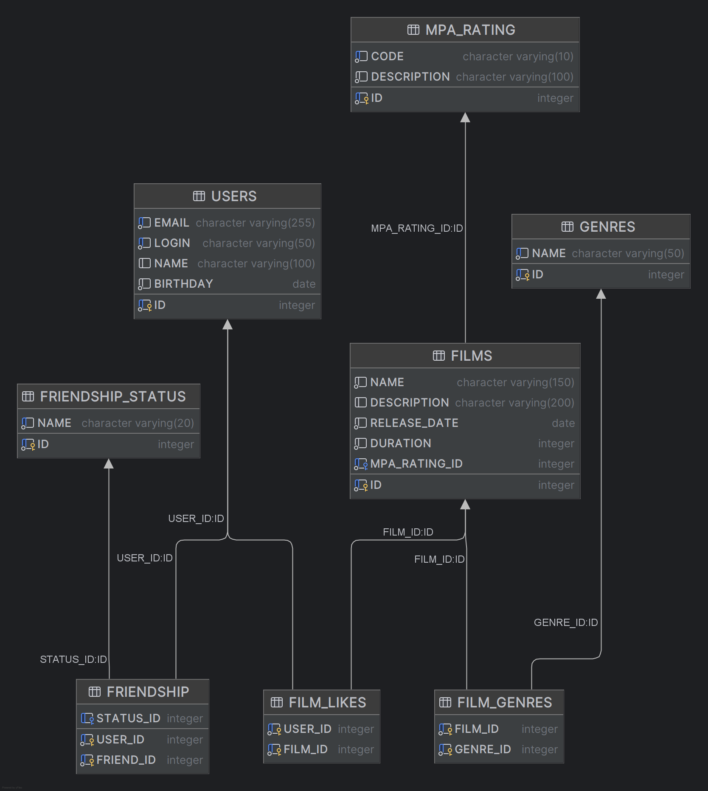

# java-filmorate
Template repository for Filmorate project.

Описание таблиц базы данных Filmorate

Основные таблицы
1) users - хранит информацию о пользователях:
Уникальные email и login
Имя (необязательное поле)
Дата рождения

2) mpa_rating - возрастные рейтинги:
Код (например, "G", "PG-13")
Описание рейтинга

3) genres - жанры фильмов с уникальными названиями

4) films - основная информация о фильмах:
Название, описание, дата выпуска
Продолжительность (должна быть положительной)
Ссылка на рейтинг MPA

Связующие таблицы
5) film_genres - многие-ко-многим между фильмами и жанрами

6) film_likes - лайки пользователей к фильмам

7) friendship - дружеские связи между пользователями с:

8) friendship_status - статусами дружбы (например, "подтверждено", "ожидание")